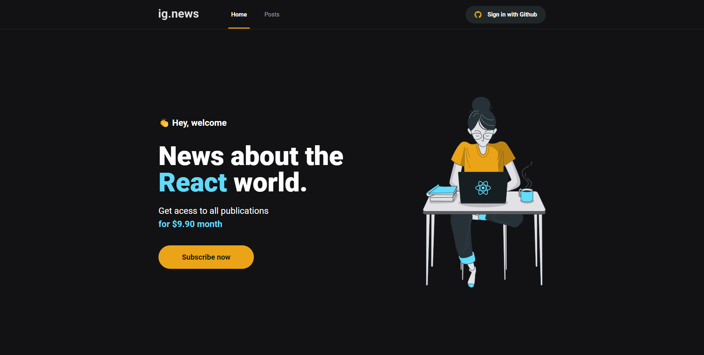

# ignews



> Plataforma de entrega de artigos sobre ReactJs através de assinatura, com funcionalidade de preview para os não assinantes.

## 💻 Tecnologias

* ReactJs;
* Next.js;
* TypeScript;
* FaunaDB;
* Stripe;
* Prismic CMS.

## 💻 Pré-requisitos

Antes de começar, verifique se você atendeu aos seguintes requisitos:

* Você instalou alguma versão de `Node.js e Yarn/NPM`;

## 🚀 Instalando ignews

Para instalar o ignews, siga estas etapas:

yarn:
```
yarn
```

npm:
```
npm install
```

## ☕ Usando ignews

Para usar ignews, siga estas etapas:

yarn:
```
yarn start
```

npm:
```
npm start
```

[⬆ Voltar ao topo](#ignews)<br>
